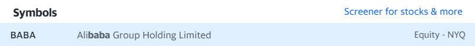

Yahoo Finance
Yahoo Finance is a popular financial website and online platform that provides a wide range of financial information, tools, and resources for investors, traders, and individuals interested in financial markets.

Yahoo Finance offers a comprehensive collection of financial data and news, including stock quotes, historical price charts, financial statements, analyst ratings, market trends, and economic indicators. Users can track individual stocks, mutual funds, exchange-traded funds (ETFs), indices, and currencies.

The platform also includes features such as portfolio tracking, customizable watchlists, stock screener tools, and interactive charts for technical analysis. Additionally, Yahoo Finance provides access to news articles, expert analysis, and commentary on various market-related topics.

Yahoo Finance is widely used as a valuable resource for market research, tracking investments, and staying informed about the latest developments in the financial world.

Hands working

## Yahoo 001 - Take a Target Symbol
in Yahoo finance is possible to see it all historical public data in there.
if you visit:
1 - Visit the site:
https://finance.yahoo.com/

if you not have account and need to income in next level my sugestion for you create account there.

Now we need to take some notes:
1 - Select one Brand or signal to see it: used BABA - Alibaba Group Holding.

Yahoo Finance offers a comprehensive collection of financial data and news, including stock quotes, historical price charts, financial statements, analyst ratings, market trends, and economic indicators. Users can track individual stocks, mutual funds, exchange-traded funds (ETFs), indices, and currencies.

The platform also includes features such as portfolio tracking, customizable watchlists, stock screener tools, and interactive charts for technical analysis. Additionally, Yahoo Finance provides access to news articles, expert analysis, and commentary on various market-related topics.

Yahoo Finance is widely used as a valuable resource for market research, tracking investments, and staying informed about the latest developments in the financial world.

## Yahoo 001 - Take a Target Symbol
Yahoo finance is possible to see it all historical public data in there.
1 - Visit the site:
https://finance.yahoo.com/

If you not have account and need to income in next level my sugestion for you create account there.

Now we need to take some notes:
1 - Select one Brand or signal to see it: used BABA - Alibaba Group Holding.

You see page like this:

