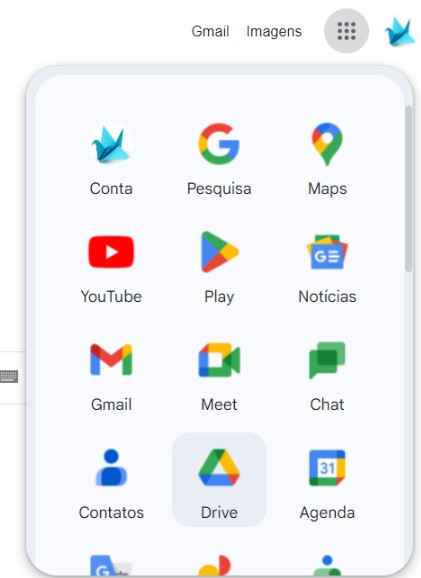
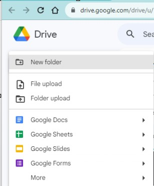
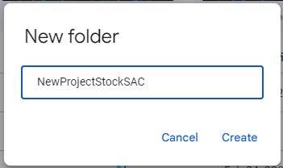
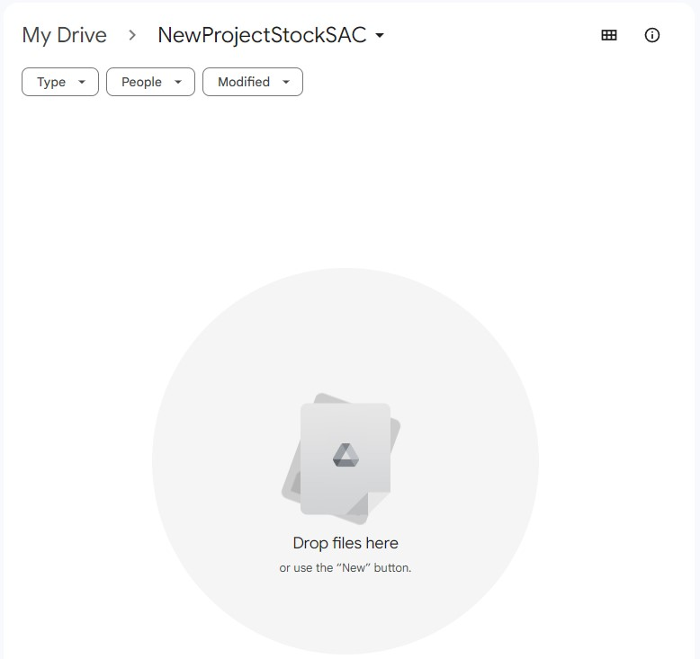
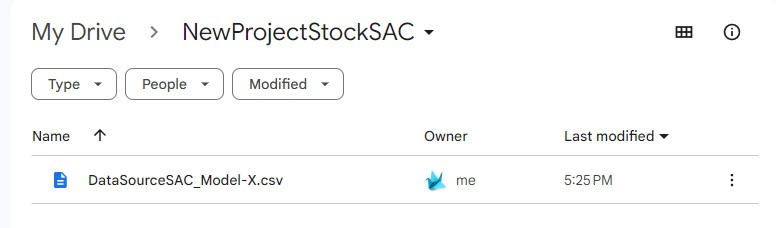

Now we start to use the google drive.

Is necessary to have Google Account.

## Google Drive 001 - Access Google Drive.
Click in App in your user.

## Google Drive 002 - Add new Folder
Add new folder.

## Google Drive 003 - Create a New name.

## Google Drive 004 - Drag Drop the file.

## Google Drive 005 - Upload The file.

## Google Drive 006 - one more works done.

