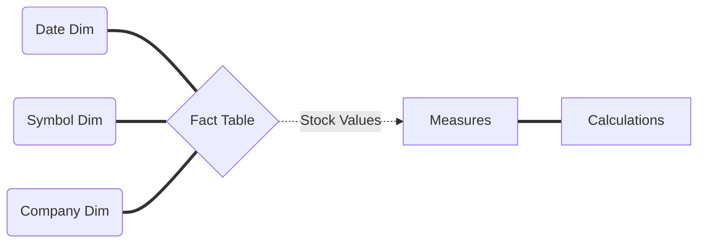

Now you start to make your job in SAP Analitic Cloud.

In this document we will create a model in SAC. 
To this we need go SAC.

## SAC Modeling 001 - Points we need to know
This model we wil create to get each objects as necessary in this material. 
Below have a simple diagram what you need to know.

## SAC Modeling 002 - Create a new model:
A - In SAC Tenant, click in Modeler into trhee dot.  

B - Create New.  
 
 
 
 
C - New Model (Recomendation)  
 

## SAC Modeling 003 - Configurate model:
Now you need to do it the model.  
D - add the measure.
 

  
### SAC Configurate model Create Measures
E - add the measure.
 

F - OPEN.
 

G - High.
 

  

