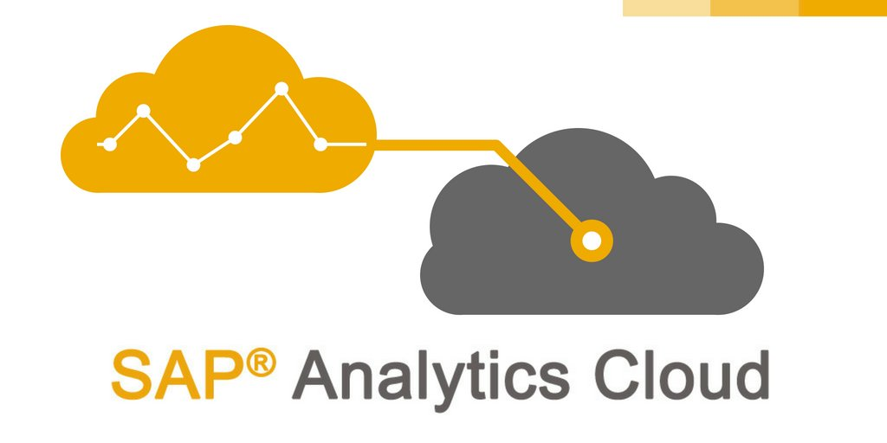

Now you start to make your job in SAP Analitic Cloud.



In this document we will create a model in SAC.
To this we need go SAC.

## SAC Modeling 001 - Points we need to know
This model we wil create to get each objects as necessary in this material.
Below have a simple diagram when you need to know.
```mermaid
flowchart LR
B(Date Dim) === C{Fact Table}
D(Symbol Dim) === C{Fact Table}
E(Company Dim) === C{Fact Table}
C{Fact Table} -.Cst.ID.-> A[Measures]
A[Measures] === Z[Calculations]

```


## SAC Modeling 002 - XIXIXIXIXIX
