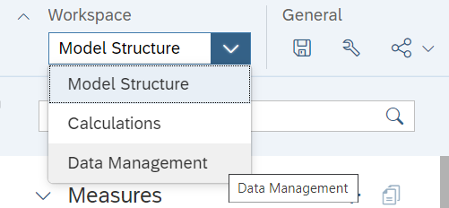
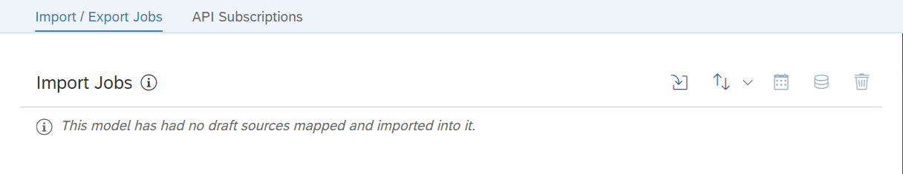
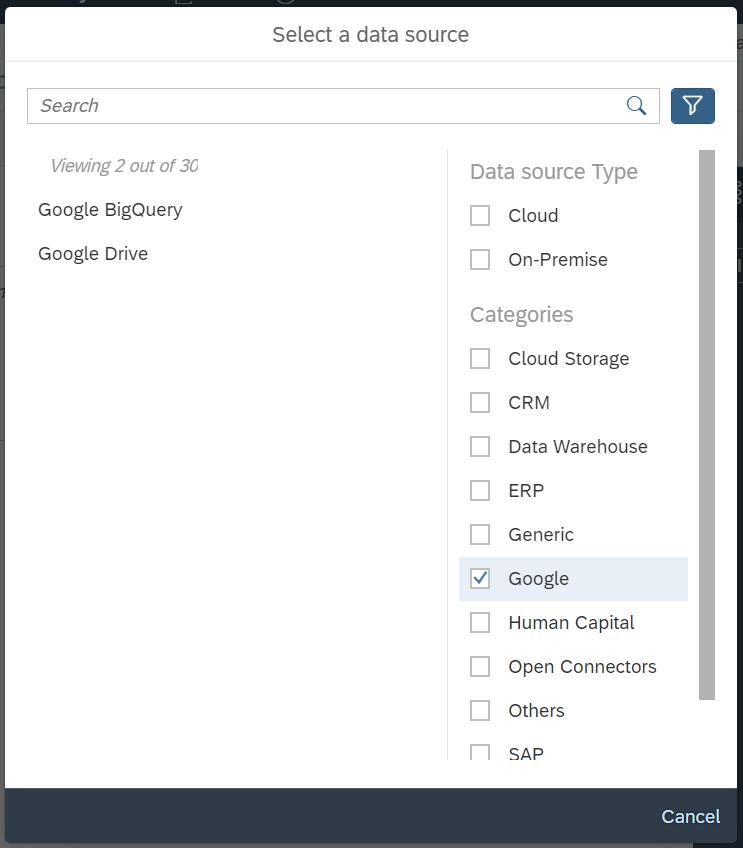
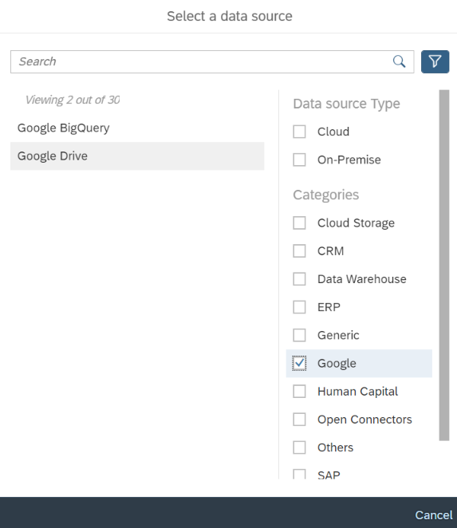
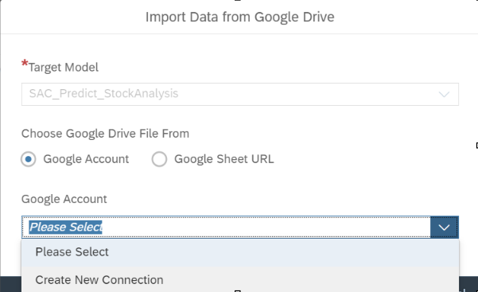
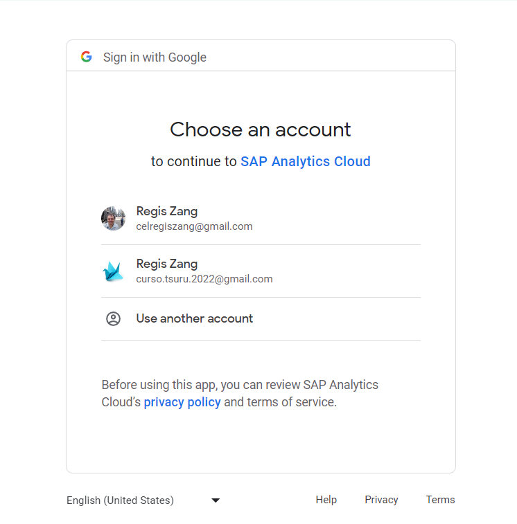

Now you keep to Continue your job in SAP Analitic Cloud.
 
We fill data into the Model
 

  

## SAC Import Data 001 - Create a connection in Google Cloud.
This model we wil create to get each objects as necessary in this material. 
Below have a simple diagram what you need to know.
Go to The model and click in WorkSpace 
Image  = SAC_ImportData001

  

 
Image  = SAC_ImportData002
DataManagemnt

  

 
In DataManagemnt we need to click in import Icon 

  

 
 
In Select a data source to click in Google 

  

 
 
In Select a data source to click in Google Drive 

  

 

Select Creat a new connection 

  

 
Select a account what you need to access 

  

 

## SAC Import Data 002 - Access the connection in Google Cloud.
This model we wil create to get each objects as necessary in this material. 
Below have a simple diagram what you need to know.

