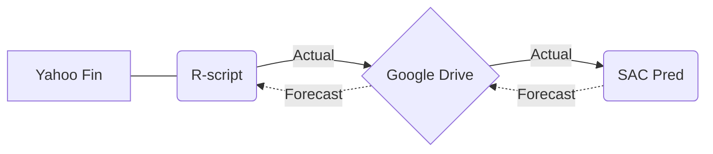

# ExploringRscriptAndSAPPredictiveAnalysis
Forecasting the Future: Leveraging R-script, SAP SAC, and Detailed Time Series Analysis

[#1 - Yahoo Finance](https://github.com/regis-zang/ExploringRscriptAndSAPPredictiveAnalysis/blob/main/1_Yahoo_Finance.md,"Understand better the Data provider")  
[#2 - R-Script](https://github.com/regis-zang/ExploringRscriptAndSAPPredictiveAnalysis/blob/main/2_R_Script.md)  
[#3 - Google Drive](https://github.com/regis-zang/ExploringRscriptAndSAPPredictiveAnalysis/blob/main/3_GoogleDrive.md)  
#4 - SAC - Creating a Model  <b><i>W.I.P. 11-sep-2023 </i></b>   
#5 - SAC - Setting Predictive Time Series 18-sep-2023  
#6 - SAC - Different Analysis in Model Predictives 
#7 - SAC - Validate The Model 
#8 - Export Data Forecast in Google Drive(Repository of Data Source) 

The idea is to create end-to-end Analytical Data from the Source data with R-script.
R-Script Activities.
Create the information and share it in Google Drive as Repository.

SAP Analytics Cloud.
Create a Planning Model.
Create Simple Storie with Actual Data.

<b><i>Explain more deep Statistical knowledge </i></b>

Create Predictive Scenarios with different configurations and explanations.

Save the Forecast in Target Source.

Simulate an evaluation model..

It is my first project in a github.
need your patience if some time isnt clear.

Remember this project i try to explain all step need to do and allow you to see in another perspective its possible to learn and enjoy in same time.
With this i used to better way and you see all are is necessary to anderstand any point.
And if is not clear , again let me know.

Best regards
Regis Zang

