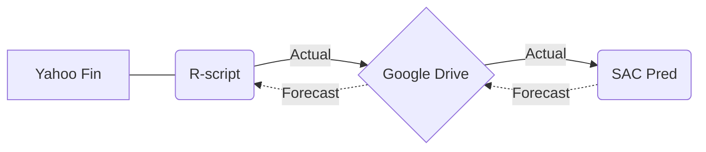

# ExploringRscriptAndSAPPredictiveAnalysis
Forecasting the Future: Leveraging R-script, SAP SAC, and Detailed Time Series Analysis

#1 - Yahoo Finance
#2 - R-Script
#3 - Google Drive (Repository of Data Source)
#4 - SAC - Creating a Model
#5 - SAC - Setting Predictive Time Series
#6 - SAC - Different Analysis in Model Ppredictives
#7 - SAC - Validate The Model
#8 - Export Data Forecast in Google Drive(Repository of Data Source)

The idea is to create end-to-end Analytical Data from the Source data with R-script.
R-Script Activities.
Create the information and share it in Google Drive as Repository.

SAP Analytics Cloud.
Create a Planning Model.
Create Simple Storie with Actual Data.

<b><i>Explain more deep Statistical knowledge </i></b>

Create Predictive Scenarios with different configurations and explanations.

Save the Forecast in Target Source.

Simulate an evaluation model..

