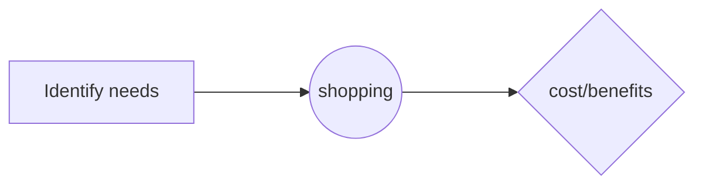
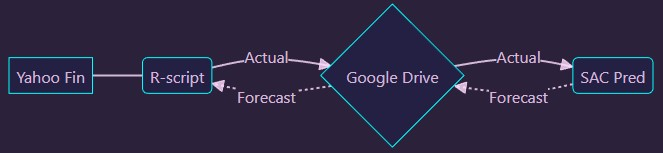

# **Sample Document Readme**

## About the Data Foundation for Google Cloud Cortex Framework
The Data Foundation for [Google Cloud Cortex Framework](https://cloud.google.com/solutions/cortex) is a set of analytical artifacts that can be automatically deployed together with reference architectures.

